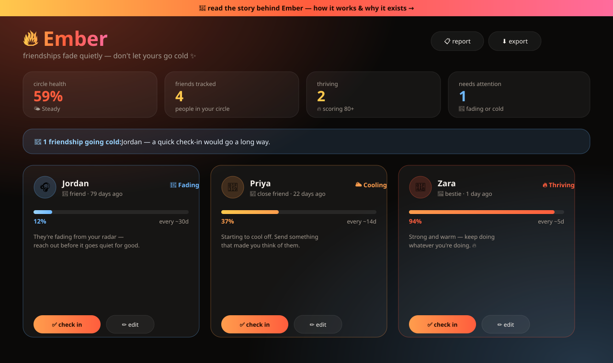
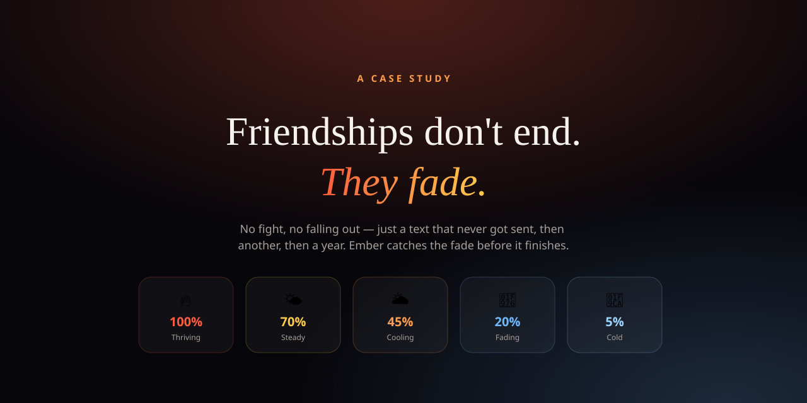

<div align="center">


[](https://ember-nine-omega.vercel.app)
[](https://ember-nine-omega.vercel.app/story.html)
[](LICENSE)

<a href="https://ember-nine-omega.vercel.app">
  
</a>

</div>

<br/>

## 🔥 What is Ember?

**Ember is a Friend Health Score tracker.** Adult friendships rarely end in a fight — they end in silence, one skipped text at a time. Ember gives every friendship in your life a live, honest score that cools the longer you go without connecting, and warms right back up the moment you check in — like an ember you have to keep tending or it goes cold.

Built for busy adults who don't need another social network — just a quiet nudge before someone they love slips away.

📖 **[Read the full story](https://ember-nine-omega.vercel.app/story.html)** — the problem, the idea, and how the score actually works.

<br/>

## 📸 A glimpse

<div align="center">

<br/><br/>

</div>

<br/>

## 📑 Table of contents

- [What is Ember?](#-what-is-ember)
- [A glimpse](#-a-glimpse)
- [Features](#-features)
- [How the score works](#-how-the-score-works)
- [Tech stack](#-tech-stack)
- [Run it locally](#-run-it-locally)
- [Privacy & security](#-privacy--security)
- [Roadmap](#-roadmap)
- [License](#-license)

<br/>

## ✨ Features

| | |
|---|---|
| 🔥 **Friend Health Score** | Every friend gets a 0–100% score that cools over time, tuned to how close you are (bestie / close / friend / family / acquaintance, or a fully custom cadence) |
| 🫀 **Circle Health dashboard** | Your overall average score, plus counts of who's thriving and who needs attention |
| 🥺 **Smart nudges** | Plain-language prompts ("send one text", "float a hangout date") tuned to exactly how cold a friendship has gotten |
| ✅ **One-tap check-ins** | Log a text, call, hangout, event, or birthday — the score warms right back up |
| 🔎 **Filters & search** | Jump straight to friends who need attention, ones who are thriving, or your archive |
| 📋 **Shareable report** | Copies a ranked, plain-text check-in list to your clipboard — paste it anywhere |
| 📊 **CSV export** & 🗄 **JSON backup/import** | Your data, fully portable |
| 📦 **Archive, don't delete** | Someone traveling or in a rough season? Archive them without losing their history |

<br/>

## 🧠 How the score works

Each friendship has a **cadence** — how often you two ideally connect. The score starts at 100% right after a check-in, eases down to ~70% right on schedule, then falls off faster the longer it's overdue — an ember cooling once you stop tending the fire.

| Score | Band |
|---|---|
| 80–100% | 🔥 Thriving |
| 55–79% | 🌤️ Steady |
| 30–54% | 🌥️ Cooling |
| 10–29% | 🥶 Fading |
| 0–9% | 🧊 Cold |

<br/>

## 🛠 Tech stack


No React, no build step, no framework — **vanilla HTML/CSS/JS**, deployed as a static site on **Vercel**, with **`localStorage`** as the only "database." Custom `<canvas>` particle animation and a self-hosted variable serif font power the story page — no external runtime dependencies at all.

<br/>

## 🚀 Run it locally

Static site, no build step, no dependencies.

```bash
git clone https://github.com/maherkhan-builds/ember-friend-health.git
cd ember-friend-health
npx serve .
```

Then open the printed URL — or just double-click `index.html`.

<br/>

## 🔐 Privacy & security

- **100% local.** Everything lives in your browser's `localStorage`. No account, no server, no analytics, no network requests.
- **Strict Content Security Policy** — no external scripts, styles, fonts, or images can load at runtime.
- **XSS-safe rendering** — all user input is rendered as text, never as HTML.
- Nothing to hack, because nothing is ever sent anywhere. Use the JSON backup to move your circle between devices.

<br/>

## 🗺 Roadmap

- [ ] PWA manifest for phone install
- [ ] Browser notifications for friendships going cold
- [ ] Custom domain

<br/>

## 📄 License

MIT — see [LICENSE](LICENSE).

<br/>

<div align="center">


**AI educator & no-code builder** · [digimarketingstudio.com](https://digimarketingstudio.com) · [LinkedIn](https://linkedin.com/in/mahersocialmediastrategistus) · [GitHub](https://github.com/maherkhan-builds)

<sub>friend health score · friendship tracker · relationship tracker · personal CRM for friends · habit tracker · reminder app · social wellness · mental wellness · gen z app · vanilla javascript · localStorage app · privacy-first · glassmorphism UI · static site · open source</sub>

</div>
